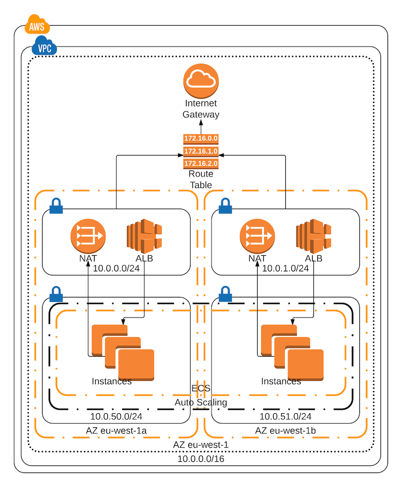
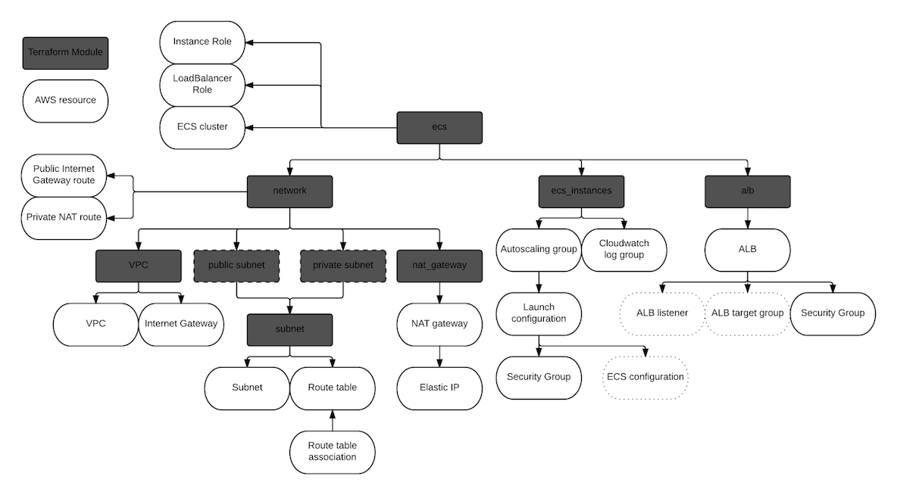

# AWS ECS

This repository contains the Terraform modules for creating a production ready ECS in AWS.

* [What is ECS?](#what-is-ecs)
* [ECS infrastructure in AWS](#ecs-infra)
* [ECS Terraform module](#terraform-module)
* [How to create the infrastructure](#create-it)
* [ECS Deployment](deployment/README.md)
* [Things you should know](#must-know)
  * [SSH access to the instances](#ssh-access-to-the-instances)
  * [ECS configuration](#ecs-configuration)
  * [Logging](#logging)
  * [ECS instances](#ecs-instances)
  * [LoadBalancer](#loadbalancer)
  * [Using 'default'](#using-default)
  * [ECS deployment strategies](#ecs-deployment-strategies)
  * [System containers & custom boot commands](#system-containers-and-custom-boot-commands)
  * [EC2 node security and updates](#ec2-node-security-and-updates)
  * [Service discovery](#service-discovery)
  * [ECS detect deployments failure](#ecs-detect-deployments-failure)

## What is ECS

ECS stands for EC2 Container Service and is the AWS platform for running Docker containers.
The full documentation about ECS can be found [here](https://aws.amazon.com/ecs/), the development guide can be found [here](http://docs.aws.amazon.com/AmazonECS/latest/developerguide/Welcome.html). A more fun read can be found at [The Hitchhiker's Guide to AWS ECS and Docker](http://start.jcolemorrison.com/the-hitchhikers-guide-to-aws-ecs-and-docker/)

To understand ECS it is good to state the obvious differences against the competitors like [Kubernetes](https://kubernetes.io/) or [DC/OS Mesos](https://docs.mesosphere.com/). The mayor differences are that ECS can not be run on-prem and that it lacks advanced features. These two differences can either been seen as weakness or as strengths.

### AWS specific

You can not run ECS on-prem because it is an AWS service and not installable software. This makes it easier to setup and maintain than hosting your own Kubernetes or Mesos on-prem or in the cloud. Although it is a service it's not the same as [Google hosted Kubernetes](https://cloud.google.com/container-engine/). Why? Google really offers Kubernetes as a SAAS. Meaning, you don't manage any infrastructure while ECS actually requires slaves and therefore infrastructure.

The difference between running your own Kubernetes or Mesos and ECS is the lack of maintenance of the master nodes on ECS. You are only responsible for allowing the EC2 nodes to connect to ECS and ECS does the rest. This makes the ECS slave nodes replaceable and allows for low maintenance by using the standard AWS ECS optimized OS and other building blocks like autoscale etc..

### Advanced features

Although it misses some advanced features ECS plays well with other AWS services to provide simple but powerful deployments. This makes the learning curve less high for DevOps teams to run their own infrastructure. You could argue that if you are trying to do complex stuff in ECS you are either making it unnecessary complex or ECS does not fit your needs.

Having said that ECS does have a possibility to be used like a Kubernetes or Mesos by using [Blox](https://blox.github.io/). Blox is essentially a set of tools that give you more control of the cluster and even more advanced deployment strategies.

## ECS infra

As stated above ECS needs EC2 nodes that are being used as slaves to run Docker containers on. To do so you need infrastructure for this. Here is an ECS production-ready infrastructure diagram.



What are we creating:

* VPC with a /16 ip address range and an internet gateway
* We are choosing a region and a number of availability zones we want to use. For high-availability we need at least two
* In every availability zone we are creating a private and a public subnet with a /24 ip address range
  * Public subnet convention is 10.x.0.x and 10.x.1.x etc..
  * Private subnet convention is 10.x.50.x and 10.x.51.x etc..
* In the public subnet we place a NAT gateway and the LoadBalancer
* The private subnets are used in the autoscale group which places instances in them
* We create an ECS cluster where the instances connect to

## Terraform module

To be able to create the stated infrastructure we are using Terraform. To allow everyone to use the infrastructure code, this repository contains the code as Terraform modules so it can be easily used by others.

Creating one big module does not really give a benefit of modules. Therefore the ECS module itself consists of different modules. This way it is easier for others to make changes, swap modules or use pieces from this repository even if not setting up ECS.

Details regarding how a module works or why it is setup is described in the module itself if needed.

Modules need to be used to create infrastructure. For an example on how to use the modules to create a working ECS cluster see **ecs.tf** and **ecf.tfvars**.

**Note:** You need to use Terraform version 0.9.5 and above

### Conventions

These are the conventions we have in every module

* Contains main.tf where all the terraform code is
* If main.tf is too big we create more *.tf files with proper names
* [Optional] Contains outputs.tf with the output parameters
* [Optional] Contains variables.tf which sets required attributes
* For grouping in AWS we set the tag "Environment" everywhere where possible

### Module structure



## Create it

To create a working ECS cluster from this repository see **ecs.tf** and **ecf.tfvars**.

Quick way to create this from the repository as is:

```bash
terraform get && terraform apply -input=false -var-file=ecs.tfvars
```

Actual way for creating everything using the default terraform flow:

```bash
terraform get
terraform plan -input=false -var-file=ecs.tfvars
terraform apply -input=false -var-file=ecs.tfvars
```

## Must know

### SSH access to the instances

You should not put your ECS instances directly on the internet. You should not allow SSH access to the instances directly but use a bastion server for that. Having SSH access to the acceptance environment is fine but you should not allow SSH access to production instances. You don't want to make any manual changes in the production environment.

This ECS module allows you to use an AWS SSH key to be able to access the instances, for quick usage purposes the ecs.tf creates a new AWS SSH key. The private key can be found in the root of this repository with the name 'ecs_fake_private'

For a new method see issue [#1](https://github.com/arminc/terraform-ecs/issues/1)

### ECS configuration

ECS is configured using the */etc/ecs/ecs.config* file as you can see [here](http://docs.aws.amazon.com/AmazonECS/latest/developerguide/ecs-agent-config.html). There are two important configurations in this file. One is the ECS cluster name so that it can connect to the cluster, this should be specified from terraform because you want this to be variable. The other one is access to Docker Hub to be able to access private repositories. To do this safely use an S3 bucket that contains the Docker Hub configuration. See the *ecs_config* variable in the *ecs_instances* module for an example.

### Logging

All the default system logs like Docker or ECS agent should go to CloudWatch as configured in this repository. The ECS container logs can be pushed to CloudWatch as well but it is better to push these logs to a service like [ElasticSearch](https://www.elastic.co/cloud). CloudWatch does support search and alerts but with ElasticSearch or other log services you can use more advanced search and grouping. See issue [#5](https://github.com/arminc/terraform-ecs/issues/5)

The [ECS configuration](#ecs-configuration) as described here allows configuration of additional [Docker log drivers](https://docs.docker.com/engine/admin/logging/overview/) to be configured. For example fluentd as shown in the *ecs_logging* variable in the *ecs_instances* module.

Be aware when creating two clusters in one AWS account on CloudWatch log group collision, [read the info](modules/ecs_instances/cloudwatch.tf).

### ECS instances

Normally there is only one group of instances like configured in this repository. But it is possible to use the *ecs_instances* module to add more groups of different type of instances that can be used for different deployments. This makes it possible to have multiple different types of instances with different scaling options.

### LoadBalancer

It is possible to use the Application LoadBalancer and the Classic LoadBalancer with this setup. The default configuration is Application LoadBalancer because that makes more sense in combination with ECS. There is also a concept of [Internal and External facing LoadBalancer](deployment/README.md#internal-vs-external)

### Using default

The philosophy is that the modules should provide as much as possible of sane defaults. That way when using the modules it is possible to quickly configure them but still change when needed. That is also why we introduced something like a name 'default' as the default value for some of the components. Another reason behind it is that you don't need to come up with names when you probably might only have one cluster in your environment.

Looking at [ecs.tf](ecs.tf) might give you a different impression, but there we configure more things than needed to show it can be done.

### ECS deployment strategies

ECS has a lot of different ways to deploy or place a task in the cluster. You can have different placement strategies like random and binpack, see here for full [documentation](http://docs.aws.amazon.com/AmazonECS/latest/developerguide/task-placement-strategies.html). Besides the placement strategies, it is also possible to specify constraints, as described [here](http://docs.aws.amazon.com/AmazonECS/latest/developerguide/task-placement-constraints.html). The constraints allow for a more fine-grained placement of tasks on specific EC2 nodes, like *instance type* or custom attributes.

What ECS does not have is a possibility to run a task on every EC2 node on boot, that's where [System containers and custom boot commands](#system-containers-and-custom-boot-commands) comes into place.

### System containers and custom boot commands

In some cases, it is necessary to have a system 'service' running that does a particular task, like gathering metrics. It is possible to add an OS specific service when booting an EC2 node but that means you are not portable. A better option is to have the 'service' run in a container and run the container as a 'service', also called a System container.

ECS has different [deployment strategies](#ecs-deployment-strategies) but it does not have an option to run a system container on every EC2 node on boot. It is possible to do this via ECS workaround or via Docker.

#### ECS workaround

The ECS workaround is described here [Running an Amazon ECS Task on Every Instance](https://aws.amazon.com/blogs/compute/running-an-amazon-ecs-task-on-every-instance/). It basically means use a Task definition and a custom boot script to start and register the task in ECS. This is awesome because it allows you to see the system container running in ECS console. The bad thing about it is that it does not restart the container when it crashes. It is possible to create a Lambda to listen to changes/exits of the system container and act on it. For example, start it again on the same EC2 node. See issue [#2](https://github.com/arminc/terraform-ecs/issues/2)

#### Docker

It is also possible to do the same thing by just running a docker run command on EC2 node on boot. To make sure the container keeps running we tell docker to restart the container on exit. The great thing about this method is that it is simple and you can use the 'errors' that can be caught in CloudWatch to alert when something bad happens.

**Note:** Both of these methods have one big flaw and that is that you need to change the launch configuration and restart every EC2 node one by one to apply the changes. Most of the time this does not have to be a problem because the system containers don't change that often but is still an issue. It is possible to fix this in a better way with [Blox](https://blox.github.io/), but this also introduces more complexity. So it is a choice between simplicity and an explicit update flow or advanced usage with more complexity.

Regardless which method you pick you will need to add a custom command on EC2 node on boot. This is already available in the module *ecs_instances* by using the *custom_userdata* variable. An example for Docker would look like this:

```bash
docker run \
  --name=cadvisor \
  --detach=true \
  --publish 9200:8080 \
  --publish=8080:8080 \
  --memory="300m" \
  --privileged=true \
  --restart=always \
  --volume=/:/rootfs:ro \
  --volume=/cgroup:/cgroup:ro \
  --volume=/var/run:/var/run:rw \
  --volume=/sys:/sys:ro \
  --volume=/var/lib/docker:/var/lib/docker:ro \
  --log-driver=awslogs \
  --log-opt=awslogs-region=eu-west-1 \
  --log-opt=awslogs-group=cadvisor \
  --log-opt=awslogs-stream=${cluster_name}/$container_instance_id \
  google/cadvisor:v0.24.1
```

### EC2 node security and updates

Because the EC2 nodes are created by us it means we need to make sure they are up to date and secure. It is possible to create an own AMI with your own OS, Docker, ECS agent and everything else. But it is much easier to use the [ECS optimized AMIs](http://docs.aws.amazon.com/AmazonECS/latest/developerguide/ecs-optimized_AMI.html) which are maintained by AWS with a secure AWS Linux, regular security patches, recommended versions of ECS agent, Docker and more...

To know when to update your EC2 node you can subscribe to AWS ECS AMI updates, like described [here](http://docs.aws.amazon.com/AmazonECS/latest/developerguide/ECS-AMI-SubscribeTopic.html). Note: We can not create a sample module for this because terraform does not support email protocol on SNS.

If you need to perform an update you will need to update the information in the *ecs_instances* and then apply the changes on the cluster. This will only create a new *launch_configuration* but it will not touch the running instances. Therefore you need to replace your instances one by one. There are three ways to do this:

Terminating the instances, but this may cause disruption to your application users. By terminating an instance a new one will be started with the new *launch_configuration*

Double the size of your cluster and your applications and when everything is up and running scale the cluster down. This might be a costly operation and you also need to specify or protect the new instances so that the AWS auto scale does not terminate the new instances instead of the old ones.

The best option is to drain the containers from an ECS instance like described [here](http://docs.aws.amazon.com/AmazonECS/latest/developerguide/container-instance-draining.html). Then you can terminate the instance without disrupting your application users. This can be done by doubling the EC2 nodes instances in your cluster or just by one and doing this slowly one by one. Currently, there is no automated/scripted way to do this. See issue [#3](https://github.com/arminc/terraform-ecs/issues/3)

### Service discovery

ECS allows the use of [ALB and ELB](deployment/README.md#alb-vs-elb) facing [Internally or Externally](deployment/README.md#internal-vs-external) which allows for a simple but very effective service discovery. If you encounter the need to use external tools like consul etc... then you should ask yourself the question: Am I not making it to complex?

Kubernetes and Mesos act like a big cluster where they encourage you to deploy all kinds of things on it. ECS can do the same but it makes sense to group your applications to domains or logical groups and create separate ECS clusters for them. This can be easily done because you are not paying for the master nodes. You can still be in the same AWS account and the same VPC but on a separate cluster with separate instances.

### ECS detect deployments failure

When deploying manually we can see if the new container has started or is stuck in a start/stop loop. But when deploying automatically this is not visible. To make sure we get alerted when containers start failing we need to watch for events from ECS who state that a container has STOPPED. This can be done by using the module [ecs_events](modules/ecs_events/main.tf). The only thing that is missing from the module is the actual alert. This is because terraform can't handle email and all other protocols for *aws_sns_topic_subscription* are specific per customer.
