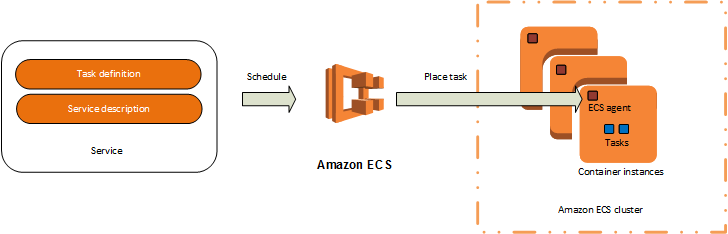
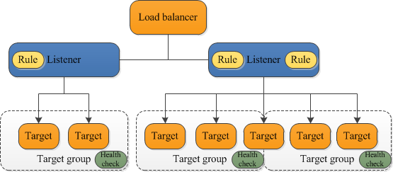

# ECS Deployment

* [What is needed for an deployment](#deployment)
* [Initial deployment](#initial-deployment)
* [How to deploy a new version?](#new-version-deployment)
* [Expose the service to the outside world](#alb-vs-elb)
* [Things you should know](#must-know)
  * [Task Definition global](#task-definition-global)
  * [Internal vs External](#internal-vs-external)
  * [Automated deployments](#automated-deployments)
  * [Container secrets](#container-secrets)

## Deployment

Deployment process on ECS consists of two steps.
The first step is registering a Task definition that holds the information about what container you want to start and what the requirements are. For instance memory, cpu or port. The second step is creating or updating a Service definition which defines a Service which eventually uses the Task Definition to start the containers on ECS and keeps them running.



The Task definition documentation can be found [here](http://docs.aws.amazon.com/AmazonECS/latest/developerguide/task_definitions.html) and the Service definition documentation can be found [here](http://docs.aws.amazon.com/AmazonECS/latest/developerguide/scheduling_tasks.html)

### Deployment user

Most deployments will be automatically, this means we need an ECS deployment user. See the [users module](../modules/users/main.tf) on how to create a proper user with proper rights. Be careful with *iam:PassRole* as described in the module, you could misuse it to give a task in ECS Admin rights.

## Initial deployment

[Automated process](#automated-deployments)

### Register a Task definition

To deploy an application to ECS for the first time we need to register a Task definition, you can see an example [here](td-nginx.json):

```json
{
  "family": "nginx",
  "containerDefinitions": [
    {
      "name": "nginx",
      "image": "nginx:alpine",
      "memory": 128,
      "portMappings": [
        {
          "containerPort": 80,
          "protocol": "tcp"
        }
      ]
    }
  ]
}
```

We are defining a Nginx docker container with 128 MB of memory and we are specifying that the container is listening on port 80. You can look at the task definition as a predefinition of the Docker run command without actually executing the run. For all possible Task definition parameters have a look at the [documentation](http://docs.aws.amazon.com/AmazonECS/latest/developerguide/task_definition_parameters.html).

This is the AWS cli command to create the Task definition:

```bash
aws ecs register-task-definition --cli-input-json file://td-nginx.json
```

### Create a Service definition

To actually run the container we need a Service, to create a service we need the Service definition like [here](service-create-nginx.json):

```json
{
    "cluster": "test",
    "serviceName": "nginx",
    "taskDefinition": "@@TASKDEFINITION_ARN@@",
    "loadBalancers": [
        {
            "targetGroupArn": "@@TARGET_GROUP_ARN@@",
            "containerName": "nginx",
            "containerPort": 80
        }
    ],
    "desiredCount": 1,
    "role": "/ecs/test_ecs_lb_role",
    "deploymentConfiguration": {
        "maximumPercent": 100,
        "minimumHealthyPercent": 0
    }
}
```

While the Task definition is not aware of the environment the Service definition definitely is. That is why we are specifying the *cluster* name and the *role*. For service to know which Task definition to run we need to specify the *taskDefinition* arn. This can be found in AWS console under Task definitions or you will get it when [Registering a Task definition](#register-a-task-definition).

We also need to provide a *targetGroupArn*, which is used to [expose the service to the outside world](#alb-vs-elb)

For all possible Service definition parameters have a look at the [documentation](http://docs.aws.amazon.com/AmazonECS/latest/developerguide/service_definition_paramters.html).

This is the AWS cli command to create the Service definition:

```bash
aws ecs create-service --cli-input-json file://service-create-nginx.json
```

## New version deployment

[Automated process](#automated-deployments)

When we want to deploy a new version of a container we need to update the Task definition and register a new revision. This is done exactly as described in [Register a Task definition](#register-a-task-definition)

### Update a Service definition

Because we already have a service we can not create a new one, we need to update it. That means we are telling the service to update our Task definition from revision X to revision Y. Therefore we just need to provide a small set of information to the service as it can be found [here](service-update-nginx.json):

```json
{
    "cluster": "test",
    "service": "nginx",
    "taskDefinition": "@@TASKDEFINITION_ARN@@",
    "desiredCount": 1,
    "deploymentConfiguration": {
        "maximumPercent": 100,
        "minimumHealthyPercent": 0
    }
}
```

This is the AWS cli command to update the Service definition:

```bash
aws ecs update-service --cli-input-json file://service-update-nginx.json
```

## ALB vs ELB

The goal is not to deploy an application but to make it accessible to the outside world or the internal services. This can be done by using the ALB (Application LoadBalancer) or the ELB (Elastic LoadBalancer). The difference is that the ELB has no knowledge of containers, it just looks at the health of the EC2 node and exposes a predefined port of that node.

ALB is 'container' aware, in the sense that the containers get registered to the ALB and that the ALB exposes containers to the outside world instead of the EC2 node. This also means that you can have multiple containers of the same type on one EC2 node.

For a full overview have a look at the [documentation](http://docs.aws.amazon.com/AmazonECS/latest/developerguide/service-load-balancing.html).

This deployment example is looking at the ALB because that makes sense in a Docker platform world. It is good to know that the ALB consists of a Listener and a target group, as seen in the illustration below. The full documentation can be found [here](http://docs.aws.amazon.com/elasticloadbalancing/latest/application/introduction.html).



The listener is the actual port that is exposed to the outside world. For the listener to route traffic to something it uses a *context path* like */api* to target the target group. The target group allows containers or other resources to register them self so that they receive the traffic. Target group also checks the health of the containers and decides if they are healthy or not.

## Must know

### Task Definition global

The Task definition is global on AWS. It means that when you create a Task definition with the name *test* you can not remove it. Even when you get rid of it in the UI the next time you create a Task definition with the name *test* it will have a revision number that is +1 of the previous version.

### Internal vs External

AWS has a concept of having an external or internal facing LB (LoadBalancer), as can be read [here](http://docs.aws.amazon.com/elasticloadbalancing/latest/classic/elb-internal-load-balancers.html) External facing means available on the internet and is probably the most used one. The internal one is not available on the internet but only inside your VPC.

The internal facing LB can be very interesting for connecting microservices without using any complicated service discovery.

### Automated deployments

Although it is posible to deploy manualy trough AWS console or executing the above commands by your self, it makes more sense to automate this process. It is posible to use one of the following scripts <https://github.com/silinternational/ecs-deploy>
Or apply KISS and do something like this (deploy.sh can be found [here](deploy.sh):

To do an initial deployment:

```bash
CONTAINER_VERSION=nginx:alpine ./deploy.sh create
```

To do an update deployment:

```bash
CONTAINER_VERSION=nginx:alpine ./deploy.sh update
```

### Container secrets

Almost all containers require some form of external values or secrets, like the database password or keys to another service. There are a lot of ways to do this, the simplest way when using ECS is by using AWS Parameter Store. Here is a [blog post](http://blog.coralic.nl/2017/03/22/docker-container-secrets-on-aws-ecs/) I wrote that describes different options and how to use AWS Parameter Store.

To allow a task to access the Parameter Store you need a role that you can assing to your task. The [ecs roles module](../modules/ecs_roles/main.tf) can create such a role.
